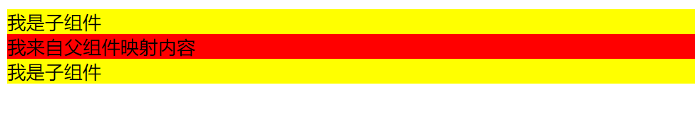
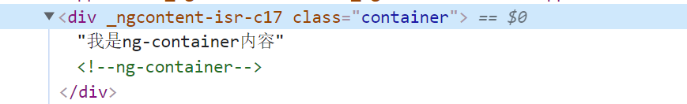
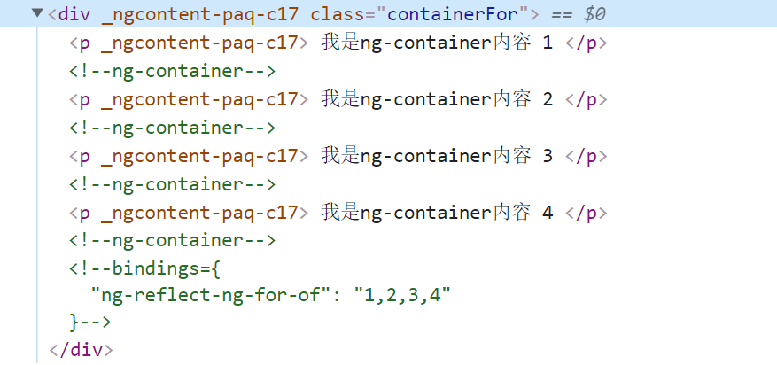

### ng-content ng-container ng-template 之间的而区别

### ng-content中可以
是内容投影。父组件可以直接在子组件中嵌入模板代码。和 vue 中的插槽slot 一个意思

父组件 index.component.html
```html
    <div>
        <app-child>
            <div style="background: red;">
                我来自父组件映射内容
            </div>
        </app-child>
    </div>
```

子组件 child.component.html
```html
    <div style="background: yellow;">
        <div>我是子组件</div>
        <ng-content></ng-content>
        <div>我是子组件</div>
    </div>
```

效果
 


ng-content 上存在一个 select;
select属性支持css选择器（”#id”,”.class”等等）
```typeScript

```


### ng-container

ng-container 相当于一个容器 可以用作组节点，不会被渲染成DOM,但会被解析为HTML的Comment(注释)

```html
  <div class="container">
    <ng-container>我是ng-container内容</ng-container>
 </div>

```
**解析出来的效果**



#### 我们也可以用他来做循环

```html
 <div class="containerFor">
  <ng-container *ngFor="let item of items"> 
    <p>
      我是ng-container内容 {{item}}
    </p> 
   </ng-container>
 </div>

```
**渲染效果**



### ng-template
ng-template 不会被直接给渲染
只有当在ng-template 上使用 属性型指令[ngIf]的时候才会被显示


```html
    <div>
    <ng-template [ngIf]="true">
        <div>
        我是ng-template 内容
        </div>
    </ng-template>
    </div>
```

总结：
ng-content 作用于子组件来做内容投影

ng-container 相当于代码容器用来包裹代码模板 不会被渲染成dom

ng-template 默认不会显示  需要通过属性指令[ngIf] 去控制，多用于模板逻辑展示