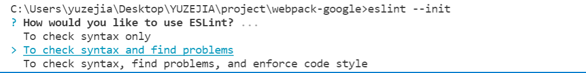

```javascript
  To check syntax only           // 只检查语法
  To check syntax and find problems   // 检查语法并查找问题
  To check syntax, find problems, and enforce code style  // 检查语法、查找问题并强制执行代码样式
```
  

  ```
√ How would you like to use ESLint? · problems
? What type of modules does your project use? ... 
> JavaScript modules (import/export)
  CommonJS (require/exports)
  None of these

    √ 您希望如何使用ESLint？·问题
    ? 您的项目使用什么类型的模块。。。
    >JavaScript模块（导入/导出）
    CommonJS（需要/导出）
    这些都不是

    Does your project use TypeScript? » No / Yes

    ? What format do you want your config file to be in? ... 
> JavaScript
  YAML
  JSON
  ```


  // @types/chrome   chrome api ts 类型支持