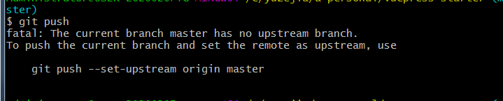

想把本地已有的一个项目传到git库上，这时候我们可以使用以下方法

1. **在gitHub上创建好git库。**

    git@github.com:yuzejia/vuepress-blog.git  


2. **在现有项目的根目录，打开 Git Bash 执行：（前提你要保证本机已经安装了git）**

    ```
    git init 
    ```

3. **创建 .gitignore 文件，该文件主要作用是设置忽略提交某些问题。如果本地项目包含了 node_module, node_module体积大，一般作为本地开发依赖使用不需要提交到远程仓库。这时候在 .gitignore 中编辑：**

    ```
    # dependencies
    /node_modules
    ```

4. **继续执行命令 将工作区更新到暂存区：**

    ```
    git add .
    ```

5. **将暂存区的内容提交到本地的版本库：** 

    引号 内是你关于本次提交改动的文字说明，项目开发中一定要养成良好的说明习惯  
    ```
    git commit -m "提交说明"
    ```

6. **本地仓库关联远程仓库：**

    ```
    git remote add origin git@github.com:yuzejia/vuepress-blog.git
    ```

    你可以通过一下命令来查看当前的远程地址：
    ```
    git remote -v
    ```

    显示以下内容，对比远程地址是否一致：

    


7. **把本地仓库推送到远程：**

    ```
    git push
    ```

    发现出现以下提示:

    

    然后就执行提示的内容就ok了：

    ```
    git push --set-upstream origin master
    ```

8. 本地项目已经成功提交远程仓库 ok~!


**还有一种最简单的方式：**
远程仓库拉取下来，把现有的项目拷贝进去 提交 ok! 就不详细说了。     