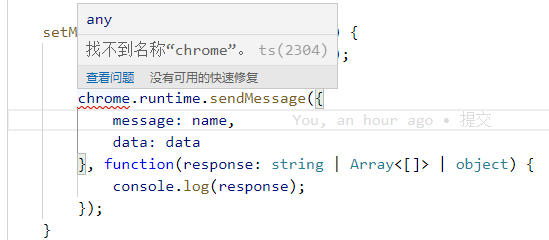
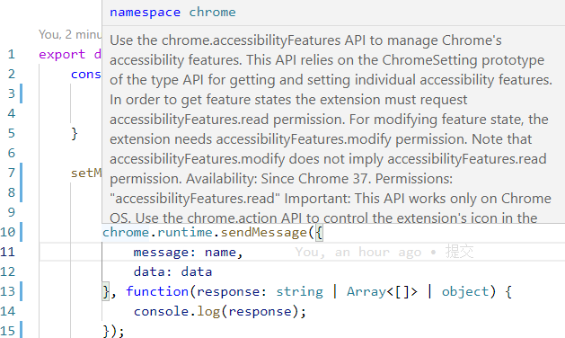

# Google 插件开发 chomeApi ts类型库
[npm地址：https://www.npmjs.com/package/@types/chrome](https://www.npmjs.com/package/@types/chrome)


## 项目依赖安装

执行命令
```
npm install @types/chrome -D
```
package.json 文件

```json
 "devDependencies": {
    "@types/chrome": "0.0.171",
    ...
```

然后在tsconfig.json 文件添加类型：
```json
{
 
    "compilerOptions": {
        ...
 
        "types": [
            ...
             
            "chrome",
 
            ...
        ],
 
 
}
```
没配置之前：


配置后：


ts类型检测可以正常使用~