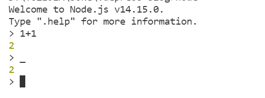
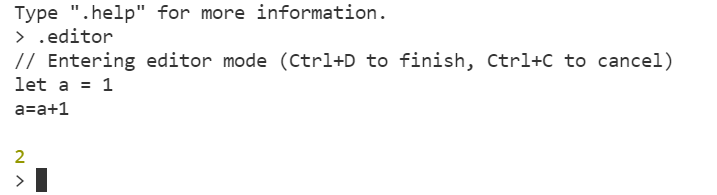
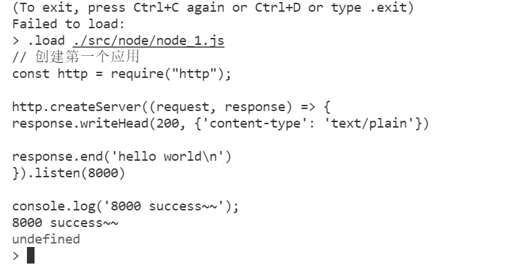
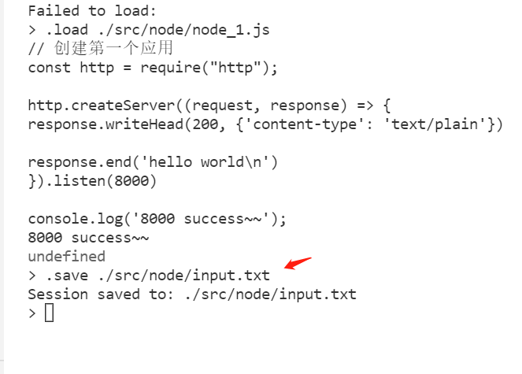
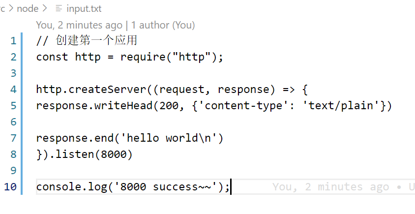

# REPL
Node.js REPL(Read Eval Print Loop:交互式解释器) 表示一个电脑的环境，类似 Window 系统的终端或 Unix/Linux shell，我们可以在终端中输入命令，并接收系统的响应。

## tab 自动补全
在编写代码时，按下tab REPL 会自动进行补全


## node 全局对象 global
输入 global. 并按下 tab 将会看到global 对象的内容输出。



_ 输出上次的结果 2


## 点命令
REPL 有一些特殊的命令，所有这些命令都以点号 . 开头。它们是：
+ help: 显示点命令的帮助。
+ editor: 启用编辑器模式，可以轻松地编写多行 JavaScript 代码。当处于此模式时，按下 ctrl-D 可以运行编写的代码。
+ break: 当输入多行的表达式时，输入 .break 命令可以中止进一步的输入。相当于按下 ctrl-C。
+ clear: 将 REPL 上下文重置为空对象，并清除当前正在输入的任何多行的表达式。
+ load: 加载 JavaScript 文件（相对于当前工作目录）。
+ save: 将在 REPL 会话中输入的所有内容保存到文件（需指定文件名）。
+ exit: 退出 REPL（相当于按下两次 ctrl-C）。
如果 REPL 能判断出是否正在输入多行的语句，则无需调用 .editor。

### .editor
输入 .editor 将进入编辑器模式。按回车等于直接换行编写。编写结束后 直接 ctrl-D 可以运行编写的代码



### .load 加载js 文件
从你当前运行 node 的目录 进行查找
```node
 .load ./src/node/node_1.js
```



### .save
保存会话内容到指定文件
```
.save ./src/node/input.txt 会话内容保存成功
```


打开input.txt 文件

