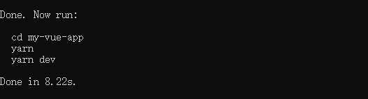
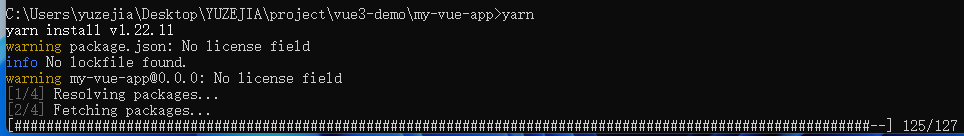
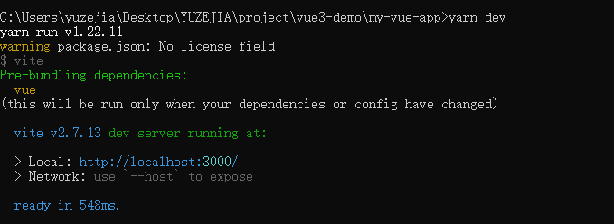
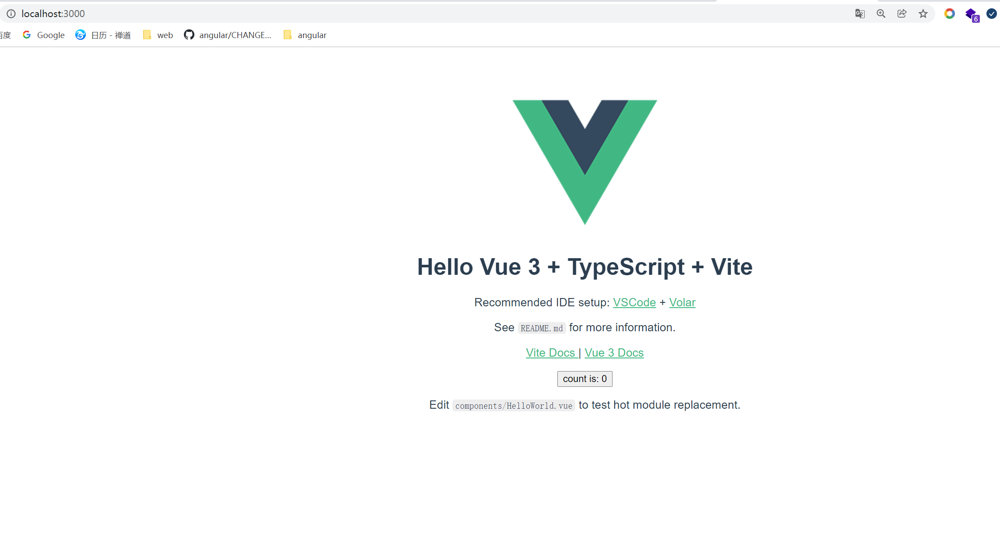

:::tip
最近在看vue3的文档内容。发现了个好玩的东西 **tport** 大家都称之为**任意传送门**。听起来似乎很有意思。 
:::
## teleport 做什么用？
我们先看一下官方文档的描述 [teleport](https://v3.cn.vuejs.org/guide/teleport.html);
看完官网描述后 什么意思呢？其实 teleport 可以把某些元素移动到其他位置。

在某些应用场景下。某个组件中会存在某些元素，这些元素是属于该组件。但是从dom 结构上来。我们希望他能够在其他dom 中出现。那怎么办？
比如 弹窗，提示信息。

我们通过例子来看一下 teleport 所做的事情。
我们先来搭建一个项目。vue3项目通过vite来构建。我们就搭建一个 vite+ts 版的。

:::tip
兼容性注意

Vite 需要 Node.js 版本 >= 12.0.0。然而，有些模板需要依赖更高的 Node 版本才能正常运行，当你的包管理器发出警告时，请注意升级你的 Node 版本。
:::
### 项目创建
我们通过yarn 来创建一个vue-ts
```
yarn create vite my-vue-app --template vue-ts
```
--template 就是我们要构建的模板参数 如果我们用 --template vue 创建出来的不是ts 版的。所以我们使用 vue-ts 参数。更过的创建方式参考：[create-vite](https://github.com/vitejs/vite/tree/main/packages/create-vite)。

 

接下来我们进入 my-vue-app 目录

执行 yarn 安装依赖
```
yarn
```
 

执行 yarn dev 启动项目



访问成功！


:::tip
vue3 上对于vsCode 的IDE 支持改成官方扩展改成了 [Volar](https://github.com/johnsoncodehk/volar),它为 Vue 3 提供了全面的 IDE 支持
:::

### teleport 使用
Teleport能够直接帮助我们将组件渲染后页面中的任意地方，只要我们指定了渲染的目标对象。Teleport使用起来非常简单。

```ts
    <script setup lang="ts">

    </script>
    <template>
        <div class="parent">
            <teleport to="body">
                <div class="children">teleport</div>
            </teleport>
        </div>
    </template>

    <style scoped>
    .parent {
        width: 200px;
        height: 200px;
        background-color: antiquewhite;
        padding: 20px;
    }

    .children {
        width: 200px;
        height: 200px;
        background-color: aqua;
    }
</style>

```
