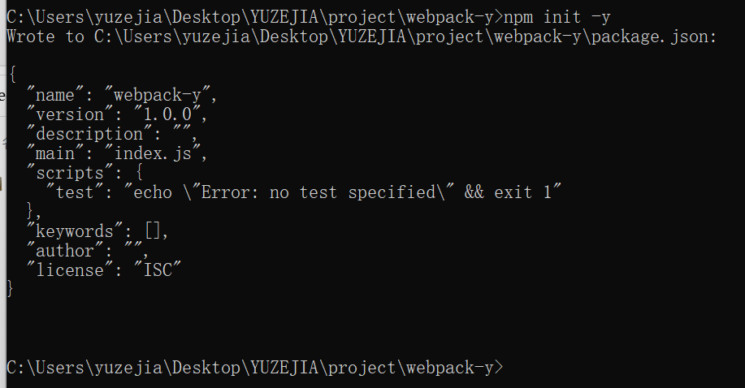
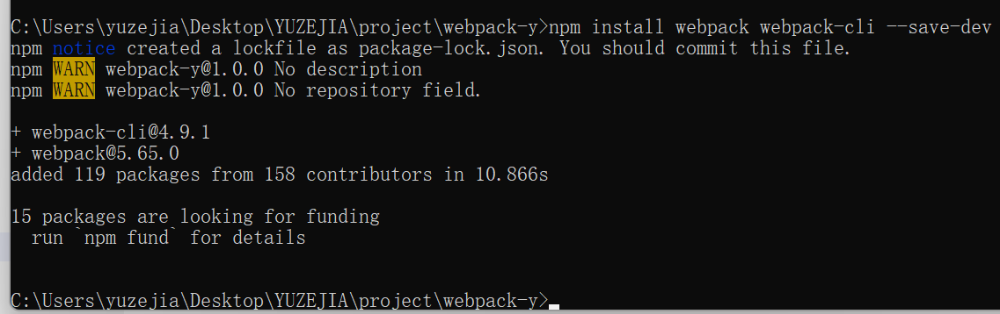
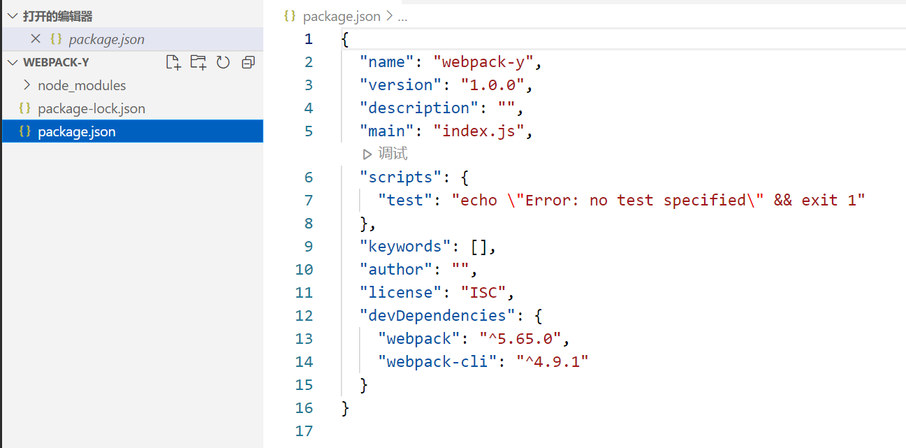
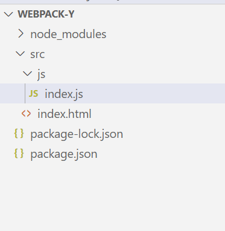
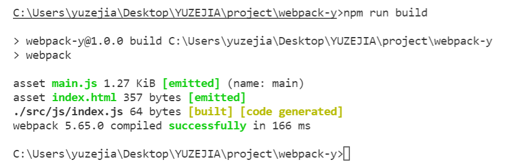
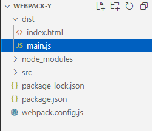
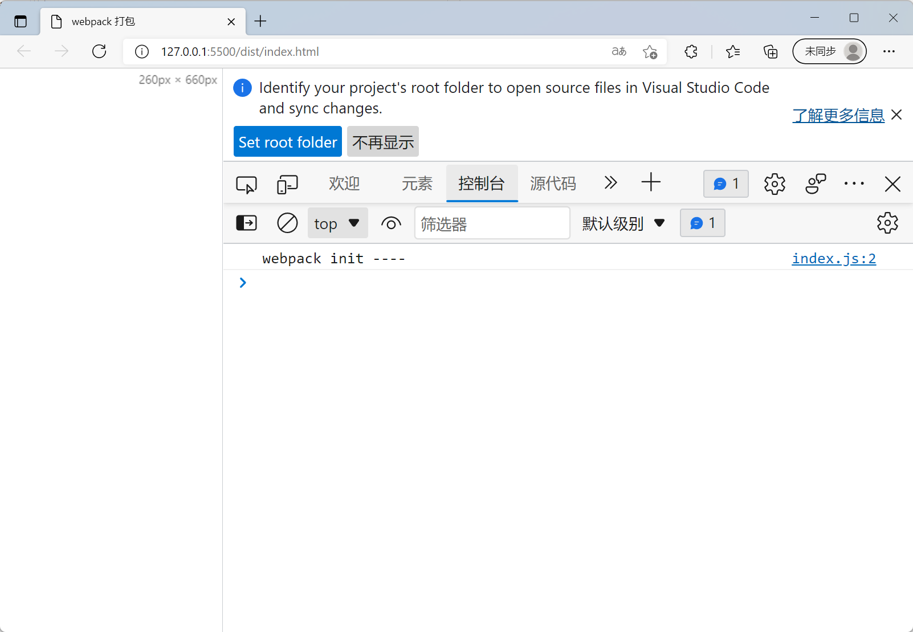

## 初始化 package.json
```cmd
npm init -y

``` 



## 安装 webpack 依赖
```
npm install  webpack webpack-cli --save-dev
```




### webpack-y 目录



## 打包js文件
### 修改了目录结构

+ 我们新建src目录,同时在src 目录下新建 index.html 文件
+ 然后在 src中新建 js目录同时新建 index.js 

#### 目录结构


#### 修改index.js内容

```javaScript
const init  = ()=> {
    console.log(' webpack init ----');
}

init()
```


## webpack.config.js 配置
新建webpack.config.js 配置文件 配置一下内容 （稍后详细说明）

```javaScript
const path  = require('path');
const HtmlWebpackPlugin = require('html-webpack-plugin');

module.exports = {
  /**
　　* 打包模式，不配置会警告，但底层还是会去配置默认的，就是production
　　* production: 压缩模式，被压缩的代码
　　* development: 开发模式，不压缩的代码
　　*
　　*/
　　mode: 'development',

    entry: './src/js/index.js', // 入口文件 要打包的文件
    output: {
        filename: 'main.js',  // 打包后的文件名
        path: path.resolve(__dirname, 'dist') // 输出目录
    },

    plugins: [

        // 打包html 模板
        new HtmlWebpackPlugin({

            /* 打包时 html 的 title (注意：仅设置这里输出的html 并不会发生改变， 
             *需要在html  模板中 使用 <title> <%= htmlWebpackPlugin.options.title %> </title>)
            */ 
            title:'webpack 打包',    
                   
            filename: 'index.html',        // 输出文件
            template: './src/index.html'   // 源模板文件 
        })
    ],

}
```

修改 package.js 文件中的 script 增加

```json
  "scripts": {
    "test": "echo \"Error: no test specified\" && exit 1",
    "build": "webpack"  // 新增 打包命令
  },
```
## 执行打包命令 

### 在命令行输入 **npm run build**


 
### webpack 已经把文件给打包完了 我们去dist 目录看下

 

 这时候我们通过浏览器运行 index.html。在控制台就能看到index.js 中的输出

 

 最基本的js 打包已经实现了~