### 接下来我们继续 打包 css 和 图片资源

我们先修改目录增加css 文件和 图片资源

src 新建css 目录 新增 style.css 文件

src 新建img 目录

我们本次修改了入口文件：
src 下新建 main.js 我们接下来将main.js 作为我们的主入口文件
#### 修改 webpack.config.js entry参数：

```js
entry: './src/main.js', // 入口文件 要打包的文件
```

#### 修改main.js 为：

```js
// 引入js 文件
require('./js/index.js')

// 引入 css 
require('./css/style.css')

```

### css 文件打包
#### 接下来我们先安装 css 打包相关 loader 

**style-loader**
**css-loader**


```
npm install style-loader css-loader --save-dev
```

#### 安装完之后 在 webpack.config.js 中配置 loader

```js
    module: {
        rules:[
            {
                test: /\.css$/i,
                use:['style-loader', 'css-loader']
            }
        ]
    },

```
#### index.html 文件新增
```html
    <div>
        <h1>webpack</h1>
    </div>
```

#### 修改 style.css 内容

```css
    h1{
        color: red;
        font-size: 12px;
    }

```


**执行 npm run build**

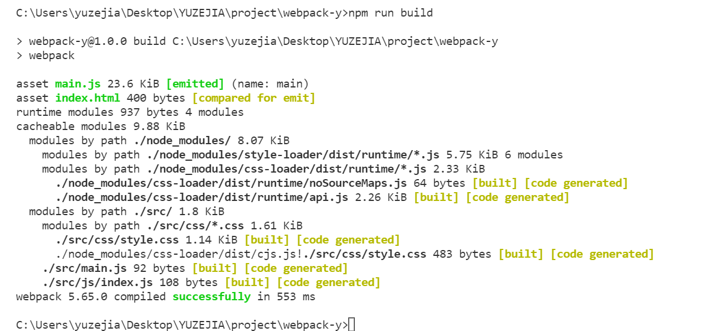
 编译成功~


**浏览器运行dist文件下的index.html**
css 样成功显示！
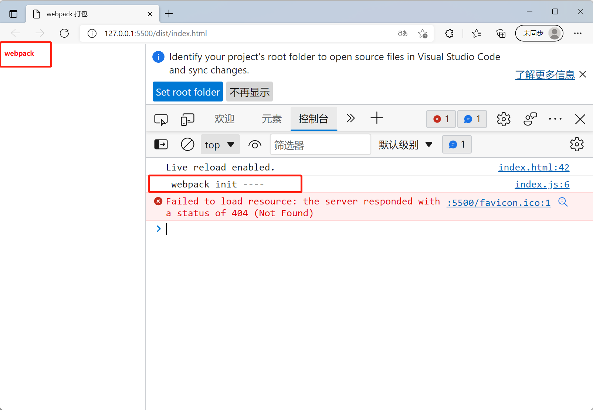


### 图片资源打包

#### 安装图片相关loader 
url-loader
file-loader
```
npm install url-loader --save-dev
```

#### webpack.config.js 配置。在 module rules 中新增以下配置信息：

```
     // 打包图片 用到 url-loader
            {
                test: /\.(png|jpe?g|gif|svg)(\?.*)?$/,
                use: {
                    loader: "url-loader",
                    options: {
                        esModule: false,   // 
                        name: "img/[name].[hash:5].[ext]",
                        limit: 1024,
                        publicpath: "../img/"
                    }
                },
                type: "javascript/auto"    // webpack5 打包 必须采用 这里要注意
            }

```
**打包输出文件。dist/img/ 生成图片文件。**
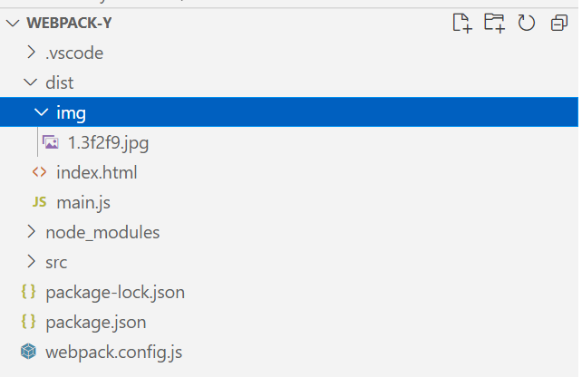

**页面中正常引用并显示。**
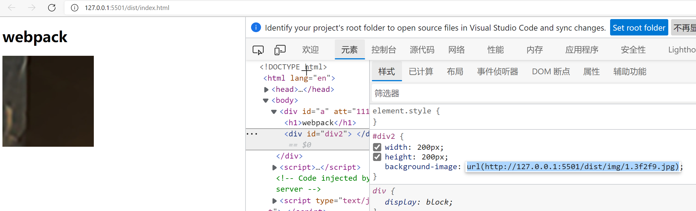

**以上为webpack 5 正确的配置信息。**

#### **在此特意补充一下（注意！）**

在webpack一开始配置的时候，并不知道webpack5丢弃了url-loader 。所以如果我们在webpack5 中使用url-loader 就要做以下配置
配置的信息为：

 ```json
     // 打包图片 用到 url-loader
            {
                test: /\.(png|jpe?g|gif|svg)(\?.*)?$/,
                use: {
                    loader: "url-loader",
                    options: {
                        esModule: false,   // 
                        name: "img/[name].[hash:5].[ext]",
                        limit: 1024
                    }
                }
            }

 ```


打包后在dist中生成了两个图片路径。img文件下。根目录下一个。按照咱们正常的 css 引用路径应该采用 img文件目录下的图片。
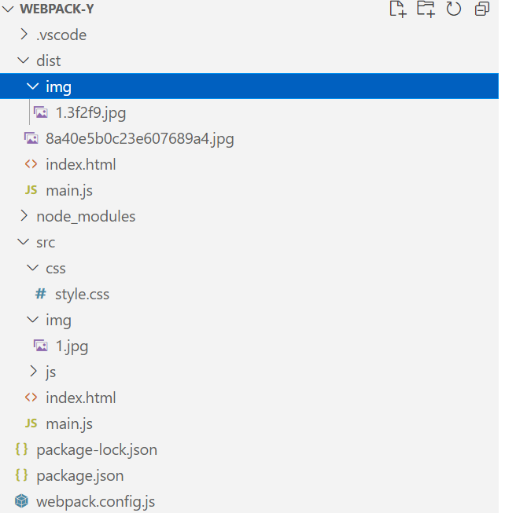

运行index.html文件。发现引用的路径为dist下的图片路径。并且页面也没正常显示。
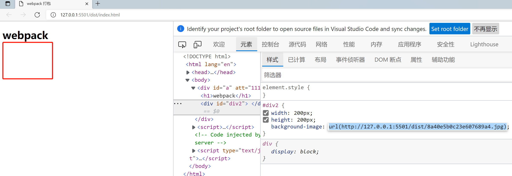
.....


然后去查询了webpack文档。文档中表示在webpack中已经丢弃url-loader

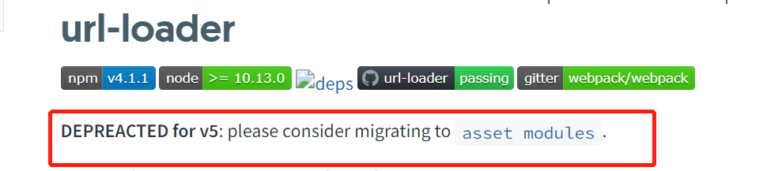

.....

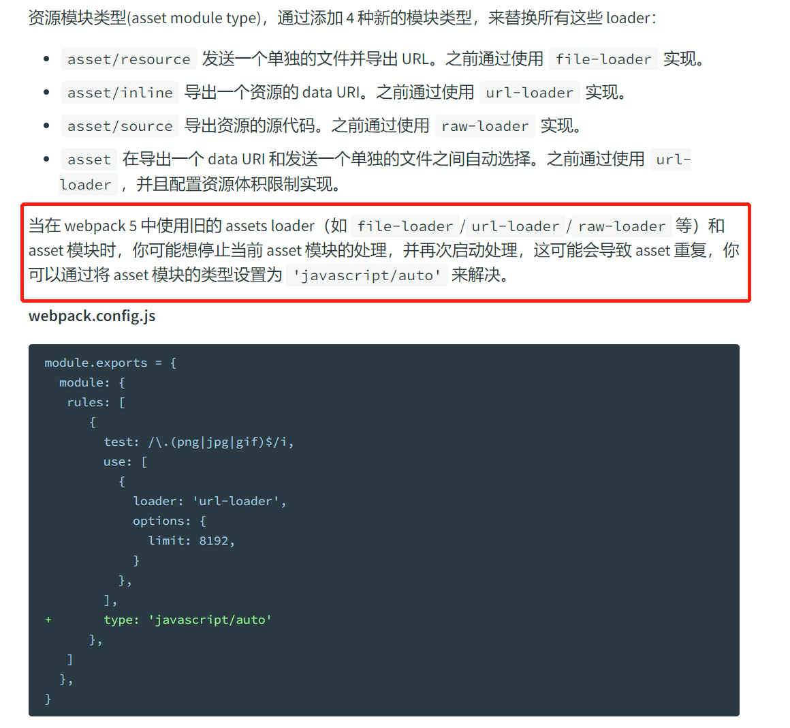

到这里能够完全正常打包 css 图片了。但是对于webpack5来说，这种写法是webpack5 兼容 url-loader的处理方式。
### asset module
#### 对于webpack5 来说直接使用 asset module。接下来我用使用asset module 来修改配置。
资源模块类型(asset module type)，通过添加 4 种新的模块类型，来替换所有这些 loader：
+ asset/resource 发送一个单独的文件并导出 URL。之前通过使用 file-loader 实现。
+ asset/inline 导出一个资源的 data URI。之前通过使用 url-loader 实现。
+ asset/source 导出资源的源代码。之前通过使用 raw-loader 实现。
+ asset 在导出一个 data URI 和发送一个单独的文件之间自动选择。之前通过使用 url-loader，并且配置资源体积限制实现。

#### 使用 **asset/inline** 来代替 url-loader。 rules 新增配置
```json
      rules:[
            {
                test: /\.css$/i,
                use:['style-loader', 'css-loader']
            },
            // {
            //     test: /\.(png|jpe?g|gif|svg)$/,
            //     use: {
            //         loader: "url-loader",
            //         options: {
            //             esModule: false,   // 使用es 模板语法 默认 true
            //             name: "img/[name].[hash:5].[ext]",
            //             limit: 1024
            //         }
            //     },
            //     type: "javascript/auto"
            // }

            //asset module 配置
            {
              test: /\.jpg/,
              type: 'asset/inline' 
           }
        ]

```
好了就这么简单。我们接下来看下效果。文件输出中没有了图片文件。页面能正常显示图片吗？
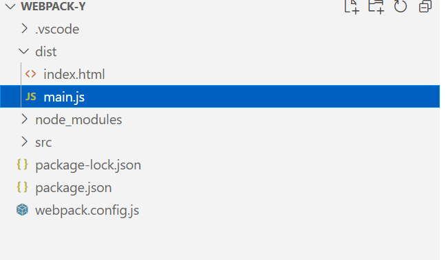

**运行index.html** 
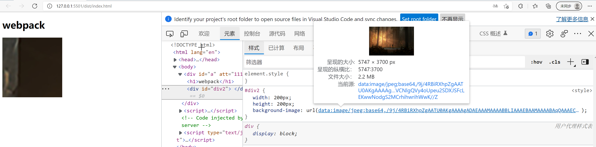

asset/inline 将图片资源转换成立 base64 并打包到了main.js 中。
好了这个时候 css 背景图片可以正常打包了。
接下来如果现在我在index.html 直接引用图片来打包。

### html-loader

将 HTML 导出为字符串。当编译器需要时，将压缩 HTML 字符串。

```
    npm install --save-dev html-loader
```
#### rules: 新增

```json
     {
            test: /\.html$/i,
            loader: "html-loader",

        }
```
**编译打包**
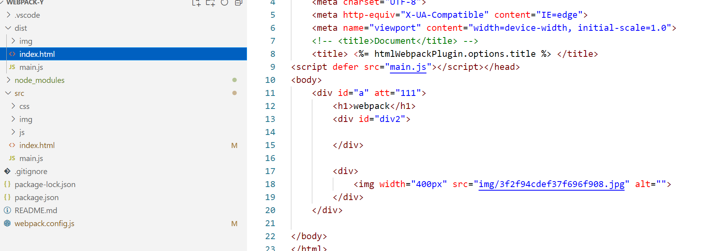

**页面也正常显示**
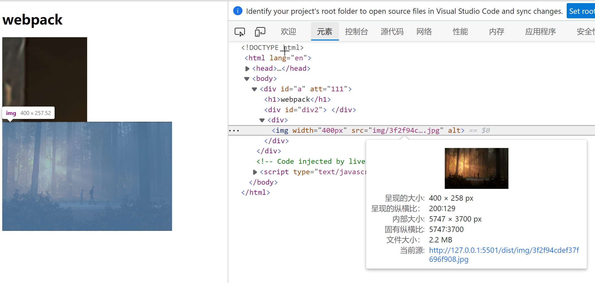

### 总结
+ webpack5 遗弃了url-loader 的支持。统一采用 asset module 代替。
+ html 中的引入请使用html-loader。
+ 最后发现一个问题html-loader 和 html-webpack-plugin 有冲突。导致title 失效。